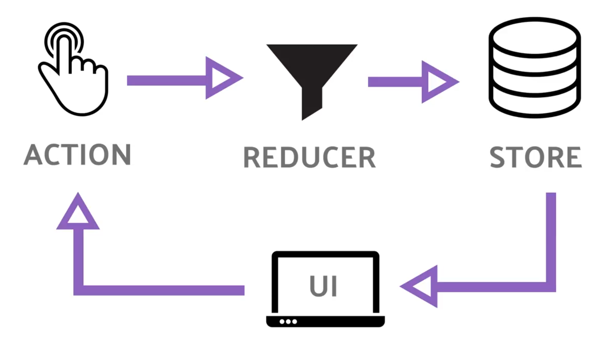

# Redux state management

[1. Redux vs NgRx](https://github.com/RukshanDias/Redux-state-management#redux-vs-ngrx) </br>
[2. High-level principle](https://github.com/RukshanDias/Redux-state-management#high-level-principle) </br>
[3. Setup Redux dev-tools](https://github.com/RukshanDias/Redux-state-management#setup-redux-dev-tools) </br>

[starter guide from fireship.io](https://fireship.io/lessons/angular-ngrx-redux-starter-guide/)

## Redux vs NgRx

-   Redux - mainly developed for react.
-   NgRx - uses Redux principles with rxjs as the undeline library.
-   Both shares similar patterns.

## High level principle

-   **UI** - display data.
-   **Action** - user perform an action that change the state. State will be changed by dispatching an action.
-   **Reducer** - Once action is dispatched, it'll go to Reducer. State will be copied and changed to a whole new state obj.
-   **Store** - the new state will be saved in the store. Client-side DB. In NgRx this consider as an observable, where we can subscribe from anywhere.

The State is immutable.



## setup Redux dev-tools

-   chrome extension to view app state in a visual manner.
-   1st install npm package, 2nd import & declare.

```
npm i @ngrx/store-devtools --save

import { StoreDevtoolsModule } from '@ngrx/store-devtools';
StoreDevtoolsModule.instrument({
      maxAge: 10, // number of states to show
    }),
```
